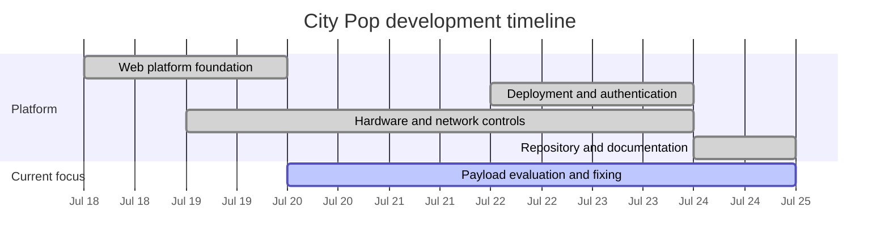
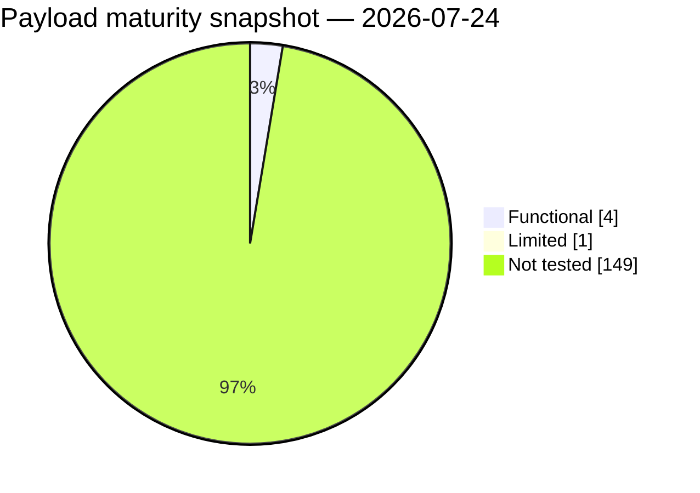

# City Pop Progress

> 🟣 **CURRENT FOCUS — PAYLOAD EVALUATION & FIXING**
>
> Validate every payload through its complete phone-controlled workflow,
> repair failures, and assign maturity only when testing evidence supports it.

The platform foundation, deployment architecture, authentication baseline,
hardware controls, and repository structure are established. Development
phases overlap where work began early or continued alongside another phase;
the dates below come from the repository's Git history.

## Progress at a glance

```text
Platform phases     [████████████████░░░░]  4 complete · 1 active
Payload validation  [█░░░░░░░░░░░░░░░░░░░]  5 of 154 reviewed · 3.2%
```

| | Phase | Dates | Status |
|:---:|---|---|:---:|
| 🟦 | **1. Web platform foundation** | 2026-07-18 → 2026-07-19 | ✅ Complete |
| 🟪 | **2. Deployment and authentication baseline** | 2026-07-22 → 2026-07-23 | ✅ Complete |
| 🟧 | **3. Hardware and network controls** | 2026-07-19 → 2026-07-23 | ✅ Complete |
| 🟩 | **4. Repository and documentation organization** | 2026-07-24 → 2026-07-24 | ✅ Complete |
| 🟨 | **5. Payload evaluation and fixing** | 2026-07-20 → present | 🚧 **In progress** |



The final duration in the active Mermaid bar is only a display window; phase 5
remains open until the catalog has been evaluated to the desired level.

## What each phase delivered

| Phase | Baseline outcome |
|---|---|
| 🟦 Web platform foundation | Phone-first UI, engagements, execution, prompts, history, loot, reports, and reconnect recovery |
| 🟪 Deployment and authentication | nginx TLS proxy, loopback Gunicorn, first-access pairing, local accounts, session controls, and installer integration |
| 🟧 Hardware and network controls | Physical-interface inventory, protected-route safeguards, mode/link management, captive/DNS workflows, and safe poweroff |
| 🟩 Repository and documentation | Application, deployment, configuration, tests, templates, and documentation separated by purpose |
| 🟨 Payload evaluation and fixing | Exercise payloads, repair their web workflows, verify cleanup and artifacts, and record evidence-based maturity |

“Complete” means the phase's baseline outcome was implemented; it does not mean
that the area is frozen or will never receive another correction.

## Payload validation board

**Snapshot: 2026-07-24**

| Maturity | Visual | Count | Share |
|---|---|---:|---:|
| 🟢 Functional | `█░░░░░░░░░░░░░░░░░░░` | 4 | 2.6% |
| 🟡 Limited | `▏░░░░░░░░░░░░░░░░░░░` | 1 | 0.6% |
| ⚪ Not tested | `███████████████████░` | 149 | 96.8% |
| **Total** | | **154** | **100%** |



The reviewed count combines `functional` and `limited`: **5 of 154 payloads
(3.2%)**. It measures catalog validation coverage—not completion of the City
Pop platform. Payloads without an explicit `@maturity` tag count as
`not tested`.

## Current-phase workflow

Each payload should move through the following checks:

1. Confirm metadata, category, description, inputs, danger level, and maturity.
2. Launch it from the phone interface under an authorized test engagement.
3. Verify preflight checks and every static or runtime prompt.
4. Exercise expected success and common failure paths on relevant hardware.
5. Confirm live output, stop behavior, child-process cleanup, and interface restoration.
6. Verify that logs and artifacts appear under the correct engagement.
7. Fix discovered problems and add a regression test where practical.
8. Set `@maturity` to `limited` or `functional` only when evidence supports it.

The detailed payload contract and maturity definitions are in
[Payload authoring](PAYLOAD_AUTHORING.md).

## Maintaining this page

Update the snapshot whenever a meaningful batch of payloads changes maturity.
The catalog totals can be checked from the repository root with:

```bash
python3 - <<'PY'
from collections import Counter
from pathlib import Path
from citypop.payload_runner import discover

payloads = discover(Path("payloads"))
print(f"Total: {len(payloads)}")
print(Counter(payload["maturity"] for payload in payloads))
PY
```

When updating progress:

1. Refresh the snapshot date, totals, percentages, text bars, and pie chart.
2. Record maturity only from completed testing—not from implementation alone.
3. Update the active phase's dates and status when the project's focus changes.
4. Add a new future phase only when it becomes part of the actual plan.
