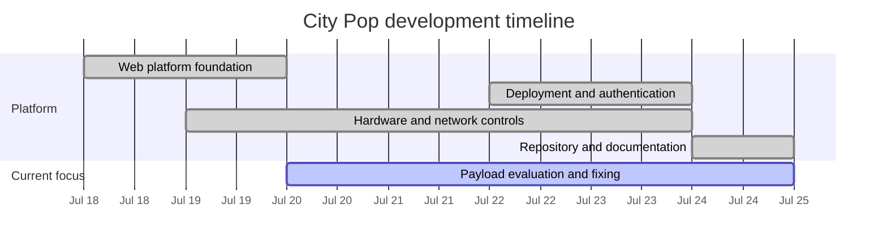
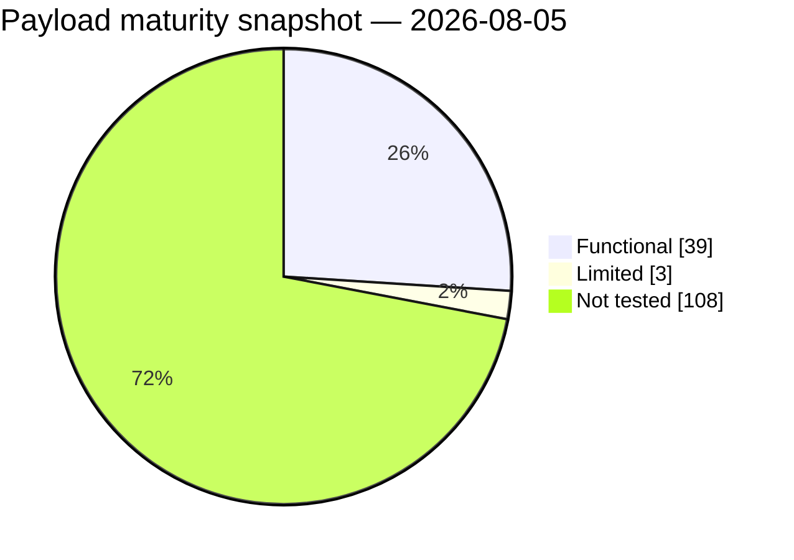

# City Pop Progress

> 🟣 **CURRENT FOCUS — PAYLOAD EVALUATION & FIXING**
>
> Validate every payload through its complete phone-controlled workflow,
> repair failures, and assign maturity only when testing evidence supports it.

The platform foundation, deployment architecture, authentication baseline,
hardware controls, and repository structure are established. Development
phases overlap where work began early or continued alongside another phase;
the dates below come from the repository's Git history.

## Progress at a glance

```text
Platform phases     [████████████████░░░░]  4 complete · 1 active
Payload validation  [██████░░░░░░░░░░░░░░]  42 of 150 reviewed · 28.0%
```

| | Phase | Dates | Status |
|:---:|---|---|:---:|
| 🟦 | **1. Web platform foundation** | 2026-07-18 → 2026-07-19 | ✅ Complete |
| 🟪 | **2. Deployment and authentication baseline** | 2026-07-22 → 2026-07-23 | ✅ Complete |
| 🟧 | **3. Hardware and network controls** | 2026-07-19 → 2026-07-23 | ✅ Complete |
| 🟩 | **4. Repository and documentation organization** | 2026-07-24 → 2026-07-24 | ✅ Complete |
| 🟨 | **5. Payload evaluation and fixing** | 2026-07-20 → present | 🚧 **In progress** |


```mermaid
gantt
    title City Pop development timeline
    dateFormat  YYYY-MM-DD
    axisFormat  %b %d

    section Platform
    Web platform foundation              :done, foundation, 2026-07-18, 2d
    Deployment and authentication        :done, deployment, 2026-07-22, 2d
    Hardware and network controls         :done, hardware, 2026-07-19, 5d
    Repository and documentation          :done, organization, 2026-07-24, 1d

    section Current focus
    Payload evaluation and fixing         :active, payloads, 2026-07-20, 5d
```

The final duration in the active Mermaid bar is only a display window; phase 5
remains open until the catalog has been evaluated to the desired level.

## What each phase delivered

| Phase | Baseline outcome |
|---|---|
| 🟦 Web platform foundation | Phone-first UI, selectable aesthetics, visible category navigation, card-triggered guidance, engagements, execution, prompts, history, loot, scoped reports, and reconnect recovery |
| 🟪 Deployment and authentication | nginx TLS proxy, loopback Gunicorn, first-access pairing, local accounts, session controls, and installer integration |
| 🟧 Hardware and network controls | Physical-interface inventory, protected-route safeguards, mode/link management, captive/DNS workflows, and safe poweroff |
| 🟩 Repository and documentation | Application, deployment, configuration, tests, templates, and documentation separated by purpose |
| 🟨 Payload evaluation and fixing | Exercise payloads, repair their web workflows, verify cleanup and artifacts, and record evidence-based maturity |

“Complete” means the phase's baseline outcome was implemented; it does not mean
that the area is frozen or will never receive another correction.

## Post-baseline refinement log

| Date | Area | Improvement |
|---|---|---|
| 2026-08-04 | Phone interface | Added persistent Citypop, Matrix, Akira, and Stealth aesthetics, then refined Matrix and Akira contrast and palette balance. |
| 2026-08-04 | Mobile navigation | Separated connection details from header actions and moved authenticated Hardware access beside Account and Power Off. |
| 2026-08-04 | Payload discovery | Replaced horizontally scrolling categories with fully visible wrapping controls and made payload cards open their Guided Workflow directly. |
| 2026-08-04 | Engagement workflow | Moved report generation and management into each engagement row, with report listing and actions scoped to that engagement. |
| 2026-08-04 | USB payload validation | Redesigned the BadUSB detector around bounded new-device tracing, pre-existing keyboard responsiveness, per-device dashboard output, private JSONL evidence, and hardware-tested `functional` maturity. |
| 2026-08-04 | Device workflow validation | Advanced Wi-Fi antenna diagnostics and the Bluetooth keyboard picker to `functional`; added the Bluetooth keyboard USB relay to the catalog as `not tested`. |
| 2026-08-05 | Catalog consolidation | Removed the AI category and its BirdNET, object-detection, and speech-to-text payloads; moved Network Anomaly Detector into Network, BLE Skimmer Scanner and Bluetooth Keyboard Picker into Bluetooth, and Disk Status into the new System category; removed unused AI-only runtime dependencies. |
| 2026-08-05 | Pi compatibility hardening | Added validated physical-Ethernet bridge setup and rollback, modern esptool invocation, truthful bounded BLE GATT behavior, and disabled unvalidated SDR transmission while retaining capture/library operations; removed the impractical dual-controller USB keylogger from the Pi Zero 2 W catalog. |
| 2026-08-06 | USB role management | Added a phone-controlled, reboot-bound Pi Zero data-port selector for HID/OTG and USB-host operation, including platform detection, boot-state reporting, parameter-preserving configuration, and a one-time recovery backup. |
| 2026-08-06 | Catalog refinement | Moved interface management, interface listing, tool checks, process listing, and system status from Utilities into System; removed dormant Unitree LCD rendering code and converted LED Controller actions into explicit web-native lists. |

## Payload validation board

**Snapshot: 2026-08-05**

| Maturity | Visual | Count | Share |
|---|---|---:|---:|
| 🟢 Functional | `█████░░░░░░░░░░░░░░░` | 39 | 26.0% |
| 🟡 Limited | `▍░░░░░░░░░░░░░░░░░░░` | 3 | 2.0% |
| ⚪ Not tested | `██████████████░░░░░░` | 108 | 72.0% |
| **Total** | | **150** | **100%** |


```mermaid
pie showData
    title Payload maturity snapshot — 2026-08-05
    "Functional" : 39
    "Limited" : 3
    "Not tested" : 108
```

## Current-phase workflow

Each payload should move through the following checks:

1. Confirm metadata, category, description, inputs, danger level, and maturity.
2. Launch it from the phone interface under an authorized test engagement.
3. Verify preflight checks and every static or runtime prompt.
4. Exercise expected success and common failure paths on relevant hardware.
5. Confirm live output, stop behavior, child-process cleanup, and interface restoration.
6. Verify that logs and artifacts appear under the correct engagement.
7. Fix discovered problems and add a regression test where practical.
8. Set `@maturity` to `limited` or `functional` only when evidence supports it.

The detailed payload contract and maturity definitions are in
[Payload authoring](PAYLOAD_AUTHORING.md).

## Maintaining this page

Update the snapshot whenever a meaningful batch of payloads changes maturity.
The catalog totals can be checked from the repository root with:

```bash
python3 - <<'PY'
from collections import Counter
from pathlib import Path
from citypop.payload_runner import discover

payloads = discover(Path("payloads"))
print(f"Total: {len(payloads)}")
print(Counter(payload["maturity"] for payload in payloads))
PY
```

When updating progress:

1. Refresh the snapshot date, totals, percentages, text bars, and pie chart.
2. Record maturity only from completed testing—not from implementation alone.
3. Update the active phase's dates and status when the project's focus changes.
4. Add a new future phase only when it becomes part of the actual plan.
